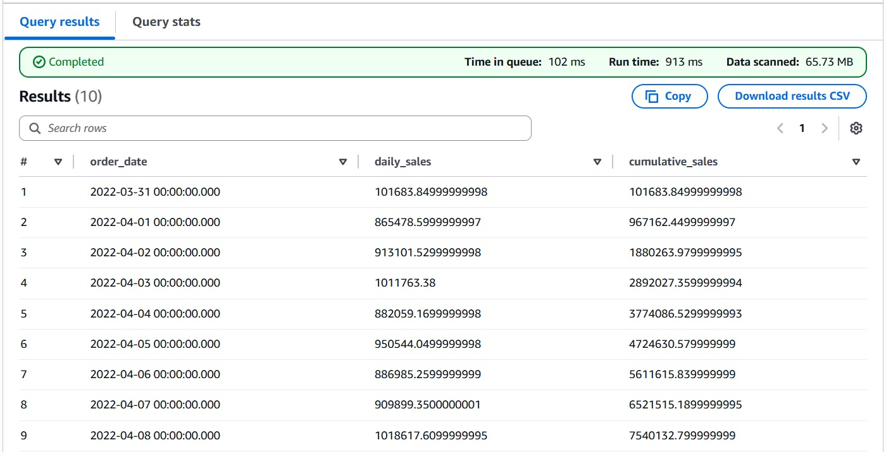
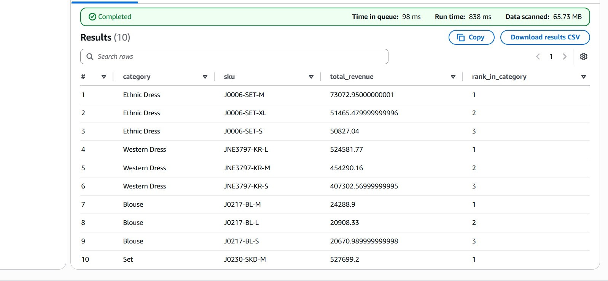
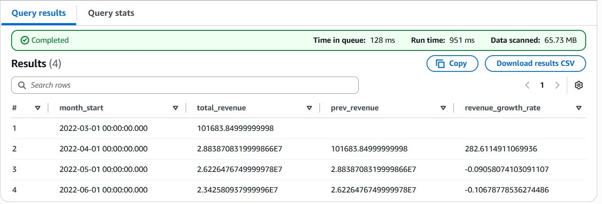
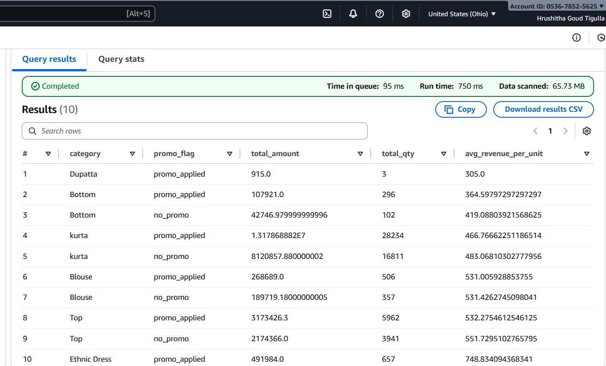
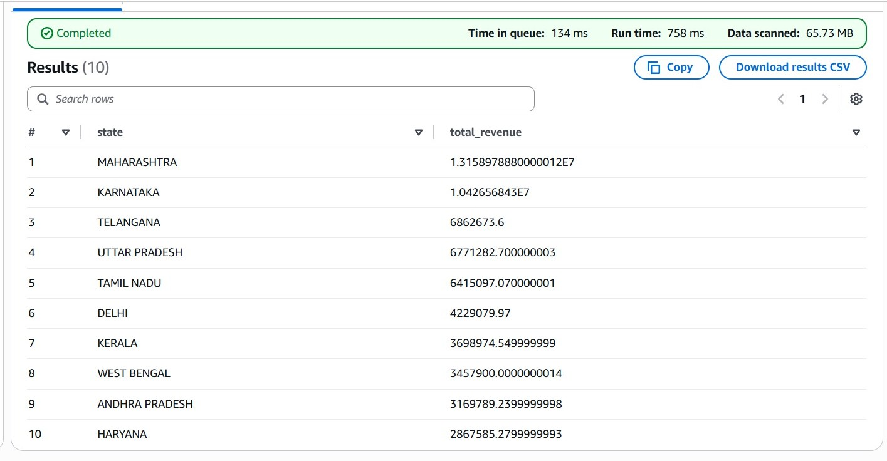

# AWS Athena Analytical Queries

This repository contains five SQL analytical queries executed on Amazon Athena for the `raw/output_db` dataset.  
The project analyzes sales performance, product trends, and growth patterns using AWS Athena, S3, IAM roles, and CloudWatch.

---

## 📁 Repository Structure
queries/ → contains the 5 Athena SQL scripts
results/ → contains the CSV result files
screenshots/ → contains screenshots of CloudWatch, IAM Role, and S3 Buckets

---

## 🧩 Queries Overview

| Query No. | Description |
|------------|-------------|
| **1** | Cumulative Sales Over Time for a Specific Year |
| **2** | Geographic Hotspot Analysis (Top or Problematic States) |
| **3** | Impact of Discounts/Promotions on Profitability |
| **4** | Top 3 Most Profitable Products Within Each Category |
| **5** | Monthly Sales and Profit Growth Analysis |

Each query is stored as a separate `.sql` file under the `/queries` directory, and corresponding CSV outputs are in `/results`.

### Query 1 

SELECT
    order_date,
    daily_sales,
    SUM(daily_sales) OVER (
        ORDER BY order_date
        ROWS BETWEEN UNBOUNDED PRECEDING AND CURRENT ROW
    ) AS cumulative_sales
FROM (
    SELECT
        date_parse("Date", '%m-%d-%y') AS order_date,
        SUM("Amount") AS daily_sales
    FROM output_db.raw
    WHERE date_parse("Date", '%m-%d-%y') BETWEEN DATE '2022-01-01' AND DATE '2022-12-31'
    GROUP BY date_parse("Date", '%m-%d-%y')
) t
ORDER BY order_date
LIMIT 10;

### Query 2

SELECT
    "ship-state" AS state,
    SUM("Amount") AS total_revenue
FROM output_db.raw
GROUP BY "ship-state"
ORDER BY total_revenue DESC
LIMIT 10;

### Query 3

SELECT
    "ship-state" AS state,
    SUM("Amount") AS total_revenue
FROM output_db.raw
GROUP BY "ship-state"
ORDER BY total_revenue DESC
LIMIT 10;

### Query 4

SELECT
    "ship-state" AS state,
    SUM("Amount") AS total_revenue
FROM output_db.raw
GROUP BY "ship-state"
ORDER BY total_revenue DESC
LIMIT 10;

### Query 5

WITH monthly_data AS (
    SELECT
        date_trunc('month', date_parse("Date", '%m-%d-%y')) AS month_start,
        SUM("Amount") AS total_revenue
    FROM output_db.raw
    GROUP BY date_trunc('month', date_parse("Date", '%m-%d-%y'))
),
monthly_with_growth AS (
    SELECT
        month_start,
        total_revenue,
        LAG(total_revenue) OVER (ORDER BY month_start) AS prev_revenue
    FROM monthly_data
)
SELECT
    month_start,
    total_revenue,
    prev_revenue,
    (total_revenue - prev_revenue) / NULLIF(prev_revenue, 0) AS revenue_growth_rate
FROM monthly_with_growth
ORDER BY month_start
LIMIT 10;

---

## ⚙️ AWS Components Used
- **S3 Bucket:** Stores the raw dataset and Athena query results.  
- **IAM Role:** Grants Athena permissions to access S3.  
- **CloudWatch:** Monitors query performance and execution logs.

---

## 📸 Screenshots
Include the following images in the `/screenshots` folder:
1. `cloudwatch.png` – Athena query log metrics  
2. `iam_role.png` – IAM role permission policies  
3. `s3_bucket.png` – S3 bucket structure showing dataset and output folders

---

## 🧠 Approach Summary
1. Connected Athena to **AwsDataCatalog → output_db → raw** table.  
2. Verified schema using `DESCRIBE output_db.raw;`  
3. Wrote 5 analytical queries using window functions, aggregation, and date parsing.  
4. Exported each result as CSV using the Athena console.  
5. Uploaded queries, results, and screenshots to GitHub.

---

## ✅ Author
**Swetha Pavuluri**  
Graduate Student – UNC Charlotte  
Course: *Cloud Computing for Data Analytics*